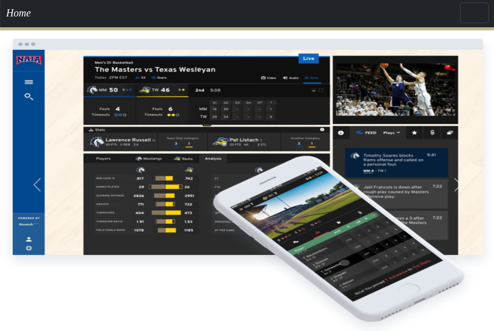

# Entry 6
##### 5/12/25

### MVP
* Before starting my MVP, I made a plan page which really helped me stay on track throughout my project. Although I did not follow the plan the whole time I was able to complete my MVP because I changed my workload for different days when I couldn't do the part that I had planned on a certain day. While working on my MVP, I included the code from my previous test projects in my terminal, this made coding a lot easier since I had most of it planned out. The content of my MVP was mostly written without a plan besides for the inventions which I had already brainstormed a while ago. In my project I had CSS, HTML, bootstrap components, grid, and also my tool animate CSS. One challenge I had was trying to make my page responsive to different screen sizes, this would often happen:
```CSS
@media (min-width:768px){
.boot {
  margin-left:400px;
}
.sub {
  margin-left:200px;
}
.bub {
  margin-left:220px;
}
}
.future {
  font-size:40px;
}
```
* This really stumped me at first because everything looked correct, but when switching screen sizes the `.future` class did not apply which made me frustrated but then I saw that the `media query` closed before the `.future` class meaning that it would not apply.
I fixed this problem across multiple media queries and it completely fixed my problems since all of them were due to this exact problem.
* Another challenge I had was pretty simple, my images wouldn't stay centered when I tried to make them take a certain width of the page, it was always looking really ugly and messy. I had no fix to this so I decided to just let it take the whole width of the page because then it would stay centered no matter what size the screen was.
* 
### Engineering Design Process

### Skills

[Previous](entry05.md) | [Next](entry07.md)

[Home](../README.md)
